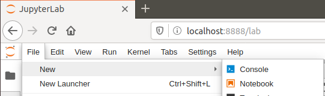
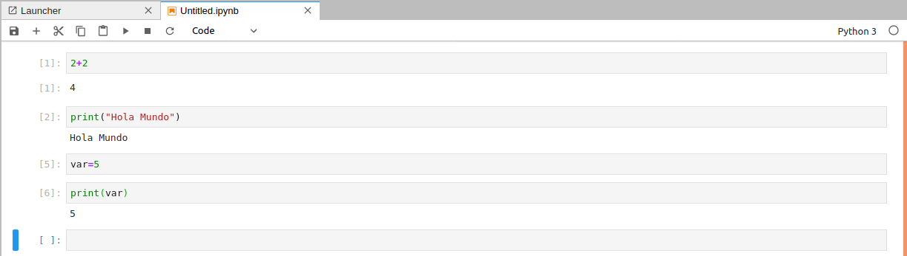

# Instalando Python

En esta lección aprenderemos a:

- Instalar un editor por defecto
- Instalar Anaconda
- Instalar JupyterLab

# Instalar un editor por defecto

Para este curso usaremos [Visual Studio Code](https://code.visualstudio.com/download). Descargar e instalar.

> Adicional, podemos usar la extensión **Python extension for Visual Studio Code**.

# Instalar Anaconda

**Para Linux:**

1. Descargar [Anaconda - Python 3.7](https://www.anaconda.com/distribution/).

chmod 777 Anaconda3-2020.02-Linux-x86_64.sh

2. Desde una terminal, instalar Anaconda ejecutando los siguientes comandos:

```bash
$ chmod 777 Anaconda3-2020.02-Linux-x86_64.sh
$ ./Anaconda3-2020.02-Linux-x86_64.sh
```
3. Aceptar todas las opciones por defecto.

4. Asegurarse responder `yes` cuando aparezca el siguiente mensaje:

```bash
Do you wish the installer to initialize Anaconda3
by running conda init? [yes|no]
```

5. Cerrar la Terminal y abrir una nueva. El prompt debe mostrar el prefijo `(base)`:
```bash
(base) axity@vm-training:~$
```

**Para Windows:**

1. Instalar con las opciones por defecto

# Instalar JupyterLab

**Para Linux:**

1. Para instalar JupyterLab, ejecutar el siguiente comando:

```bash
$ conda install -c conda-forge jupyterlab
```

2. Para iniciar JupyterLab, ejecutar el siguiente comando:

```bash
$ jupyter lab
```

**Para Windows:**

1. Por defecto Jupyter ya viene instalado.

1. Abrir la terminal **Anaconda Powershell Prompt**. Alternativamente podemos iniciar JupyterLab podemos hacerlo desde la aplicación **Anaconda Navigator**.

1. Para iniciar JupyterLab, ejecutar el siguiente comando:

```bash
$ cd <path de ejercicios>/..
$ jupyter lab
```

# Un paseo rápido por JupyterLab

Después de iniciar JupyterLab:

1. Ir a File->New->Notebook



2. Seleccionar Python



3. Ejecutar algunos comandos


