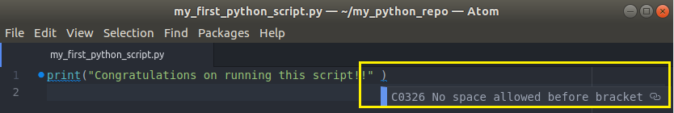
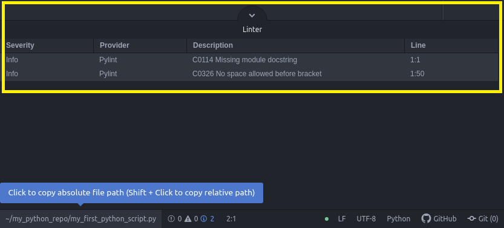

# Scripting

Hasta ahora hemos utilizado JupyterLab para poder ejecutar comandos de Python. Esto es útil para probar funciones o funcionalidades de ciertas partes del código o probar un programa completo paso por paso.

Sin embargo, en un escenario más automatizado es necesario contar con componentes que permitan la ejecución sistematizada y que inclusive permitan interactuar con el propio programa.

En esta lección aprenderemos a:

- Ejecutar y editar scripts de Python
- Interactuar con entradas de usuario
- Manejar excepciones
- Acceder a los errores
- Leer y escribir sobre archivos
- Importar Módulos Locales, Estándar y de Terceros

## Ejecutar y editar scripts de Python

La mejor forma de entender como ejecutar un script de Python, es haciendo un ejercicio real:

1. Desde una **Terminal**, crear el directorio `~/my_python_repo`.
```bash
$ mkdir ~/my_python_repo
```
2. Ir a directorio `my_python_repo`.
```bash
$ cd ~/my_python_repo
```
3. Crear el archivo `my_first_python_script.py`
```bash
$ touch my_first_python_script.py
```
4. Abrir el archivo `my_first_python_script.py` con el editor Atom.
```bash
$ atom my_first_python_script.py
```
5. Ingresar la siguiente línea de código dentro del archivo:
```py
print("¡Felicidades por ejecutar su primer script!" )
```
6. Guardar y cerrar el archivo.

7. Ejecutar el siguiente comando:
```bash
$ python my_first_python_script.py
```
Resultado:
```py
¡Felicidades por ejecutar su primer script!
```
8. Hemos ejecutado nuestro primer script de Python.

## Usar pycodestyle y pylint

1. Si abrimos el archivo `my_first_python_script.py` con el editor Atom veremos un marcador azul. Si nos posicionamos sobre él, nos mostrará un mensaje el cual indica el estilo [PEP8](https://www.python.org/dev/peps/pep-0008/) que no estamos cumpliendo:



Adicional, en la parte inferior de Atom, se muestra el panel "Linter" con un listado de los mensajes asociados a errores de cumplimiento con [PEP8](https://www.python.org/dev/peps/pep-0008/).



2. Desde la **Terminal** ejecutar:
```bash
$ pycodestyle my_first_python_script.py
```
El resultado muestra los errores de estilo que existe en nuestro script
```
my_first_python_script.py:1:49: E202 whitespace before ')'
```
3. Ahora probemos con:
```bash
$ pylint my_first_python_script.py
```

`pylint` adicionalmente nos da una calificación sobre el nivel de apego a PEP8.

```
************* Module my_first_python_script
my_first_python_script.py:1:49: C0326: No space allowed before bracket
print("¡Felicidades por ejecutar su primer script!" )
                                                    ^ (bad-whitespace)
my_first_python_script.py:1:0: C0114: Missing module docstring (missing-module-docstring)

----------------------------------------------------------------------
Your code has been rated at -10.00/10 (previous run: -10.00/10, +0.00)
```

## Interactuar con entradas de usuario

En Python podemos generar scripts o programas que puedan interactuar con el usuario, es decir, solicitar algún valor de entrada para determinar el comportamiento interno del código.

Crear un archivo con el siguiente código:

```py
nombre = input("Capture su nombre: ")
print("¡Hola, {}!".format(nombre.title()))
```
Otra forma (validando el valor de entrada):

```py
numero = int(input("Capture un número entero:"))
print("hola" * numero)
```

### [Lección 09 - Ejercicio 01](http://localhost:8888/lab/tree/my_python_repo/Ejercicio%2009-01.ipynb)

## Manejo de Errores

En Python, el manejo de excepciones podemos controlarlo mediante las siguientes cláusulas:

- `try`: esta es la única cláusula obligatoria. El código en este bloque es lo primero que Python ejecuta.

- `except`: Si Python se encuentra con una excepción mientras ejecuta el bloque `try`, saltará al bloque `except` para manejar esa excepción.  

- `else`: si Python no se encuentra con ninguna excepción al ejecutar el bloque `try`, ejecutará el código en este bloque después de ejecutar el bloque try.  

- `finally`: antes de que Python deje esta declaración de prueba, ejecutará el código en este bloque finalmente, bajo cualquier condición, incluso si está terminando el programa. Por ejemplo, si Python se encontró con un error al ejecutar el código en el bloque `except` o `else`, este bloque finalmente se ejecutará antes de detener el programa.

Ejemplo:

```py
try:  
    print(x)  
except NameError:  
    print("La variable x no está definida")  
except:  
    print("Se produjo otro tipo de error")
```

Ejemplo usando `else`:

```py
try:  
    print("Hola")  
except:  
    print("Se produjo un error")  
else:  
    print("No hubo errores")
```

Ejemplo usando `finally`:
```py
try:
    print(x)
except:
    print("Se produjo un error")
finally:
    print("El try except ha terminado")
```

Podemos cachar errores específicos:

```py
try:
    # algun codigo
except ValueError:
    # algun codigo
```

Más de una excepción específica:

```py
try:
    # algun codigo
except (ValueError, KeyboardInterrupt):
    # algun codigo
```

Diferentes bloques de código para diferentes excepciones específicas:

```py
try:
    # algun codigo
except ValueError:
    # algun codigo
except KeyboardInterrupt:
    # algun codigo
```

Para mayor detalle, sobre la lista completa de tipos de excepciones predefinidas en Python, podemos verlas [aquí](https://docs.python.org/3/library/exceptions.html#bltin-exceptions).

## Accediendo a los errores

```py
try:
    x = 15/0
except ZeroDivisionError as e:
   print("Ocurrió un error de división entre cero: {}".format(e))
```

Esto debería devolver:

```py
Ocurrió un error de división entre cero: integer division or modulo by zero
```

Si no se tiene un error específico a manejar, aun así podemos acceder al mensaje de error:

```py
try:
    x = 15/0
except Exception as e:
   print("Ocurrió una excepción: {}".format(e))
```

### [Lección 09 - Ejercicio 02](http://localhost:8888/lab/tree/my_python_repo/Ejercicio%2009-02.ipynb)

##  Leer y escribir sobre archivos

Para leer un archivo:

```py
a = open('mi_archivo.txt', 'r')
datos_archivo = a.read()
print(datos_archivo)
a.close()
```

Leer línea por línea:
```py
a = open('mi_archivo.txt', 'r')
for linea in a:
    print(linea.strip())
a.close()
```

> Se debe tener cuidado de siempre cerrar los archivos, ya que de lo contrario pueden generarse errores en la ejecución.

Python proporciona una sintaxis especial, que cierra automáticamente un archivo, una vez que haya terminado de usarlo.
```py
with open("mi_archivo.txt") as a:
    for linea in a:
        print(linea.strip())
```

Para escribir sobre un archivo:

```py
a = open('mi_archivo_w.txt', 'w')
a.write("¡Hola mundo!")
a.close()
```
```py
a = open('mi_archivo_w.txt', 'a')
a.write("¡Hola mundo!")
a.close()
```
### [Lección 09 - Ejercicio 03](http://localhost:8888/lab/tree/my_python_repo/Ejercicio%2009-03.ipynb)


## Importar scripts locales

Podemos importar código de Python desde otros scripts, lo cual es útil si estamos trabajando en un proyecto muy grande, donde necesitamos organizar el código en múltiples archivos

```py
import funciones_utiles
```
Para acceder a los objetos de un módulo importado necesitamos usar un punto `"."`:
```py
import funciones_utiles
funciones_utiles.suma_cinco([1, 2, 3, 4])
```
También podemos agregar un alias al módulo importado para referenciarlo más adelante:
```py
import funciones_utiles as fu
fu.suma_cinco([1, 2, 3, 4])
```

### Usando el bloque `main`

Para evitar ejecutar sentencias ejecutables, en un script que ha sido importado como módulo en otro script, podemos incluir estas líneas en un bloque `if __name__ == "__main__"`. Alternativamente, podemos incluirlos en una función llamada `main()` y llamarla desde el bloque `if main`.

Probemos:

```py
# funciones_utiles.py

def media(lista_numeros):
    return sum(lista_numeros) / len(lista_numeros)

def suma_cinco(lista_numeros):
    return [n + 5 for n in lista_numeros]

def main():
    print("Probando función media")
    lista_n = [34, 44, 23, 46, 12, 24]
    media_correcta = 30.5
    assert(media(lista_n) == media_correcta)

    print("Probando funcion suma_cinco")
    lista_correcta = [39, 49, 28, 51, 17, 29]
    assert(suma_cinco(list_n) == lista_correcta)

    print("¡Todas las pruebas se ejecutaron correctamente!")

if __name__ == '__main__':
    main()
```

```py
# demo.py

import funciones_utiles as fu

calificaciones = [88, 92, 79, 93, 85]

media = fu.media(calificaciones)
curva = fu.suma_cinco(calificaciones)

media_c = fu.media(curva)

print("Calificaciones:", calificaciones)
print("Media Original:", media, " Nueva Media:", media_c)

print(__name__)
print(fu.__name__)
```

## Librerías estándar

Existen infinidad de módulos que podemos importar y utilizar.

Revise [Python Module of the Week](https://pymotw.com/3/) para conocer los nuevos módulos que se van incorporando constantemente.

Algunos de los módulos más usados:

- [`csv`](https://docs.python.org/3/library/csv.html): muy útil para leer y escribir archivos csv.
- [`random`](https://docs.python.org/3/library/random.html): genera números y secuencias aleatorias.
- [`string`](https://docs.python.org/3/library/string.html): más funciones sobre cadenas.
- [`math`](https://docs.python.org/3/library/math.html): algunas funciones matemáticas estándar.
- [`os`](https://docs.python.org/3/library/os.html): para interactuar con el sistema operativo
- [`os.path`](https://docs.python.org/3/library/os.path.html): submódulo of `os` para manipular rutas de directorios de archivos.
- [`sys`](https://docs.python.org/3/library/sys.html): trabaja directamente con el intérprete de Python.
- [`json`](https://docs.python.org/3/library/json.html): muy bueno para leer y escribir archivos JSON.

### Técnicas para importar módulos

Existen otras variantes de `import` que podemos usar y que son útiles en diversas situaciones.

1.  Para importar una función o clase individual de un módulo:    
```py
from nombre_modulo import nombre_objeto
```
2.  Para importar múltiples objetos individuales de un módulo:
```py
from nombre_modulo import primer_objeto, segundo_objeto
```
3.  Para renombrar un módulo:
```py
import nombre_modulo as nuevo_nombre
```
4.  Para importar un objeto de un módulo y renombrarlo:
```py
from nombre_modulo import nombre_objeto as nuevo_nombre
```
5.  Para importar todos los objetos individuales de un módulo (**NO HACER ESTO**):
```
from nombre_modulo import *
```

## Librerías de terceros

Existen cientos de librarías desarrolladas por terceros. Podemos instalarlas usando `pip`:

```py
pip install nombre_de_librería
```

Algunas librerías útiles:

- [Pandas](http://pandas.pydata.org/) - Biblioteca que contiene estructuras de datos de alto rendimiento y herramientas de análisis de datos.

- [NumPy](http://www.numpy.org/) - Paquete fundamental para la ciencia de datos con Python. Contiene, entre otras cosas, poderosos arreglos multi-dimensionales que son capacidades útiles para cálculos de álgebra lineal.

- [Pyspark](https://spark.apache.org/docs/latest/api/python/index.html) - Librería para procesamiento de grandes volúmenes de datos sobre Spark.

### [Lección 09 - Ejercicio 04](http://localhost:8888/lab/tree/my_python_repo/Ejercicio%2009-04.ipynb)
